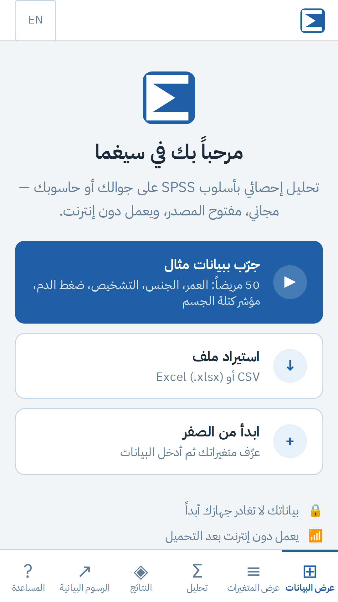
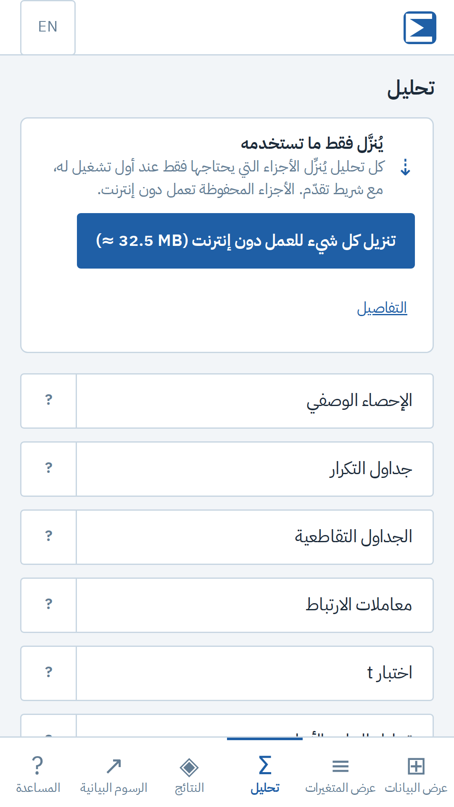
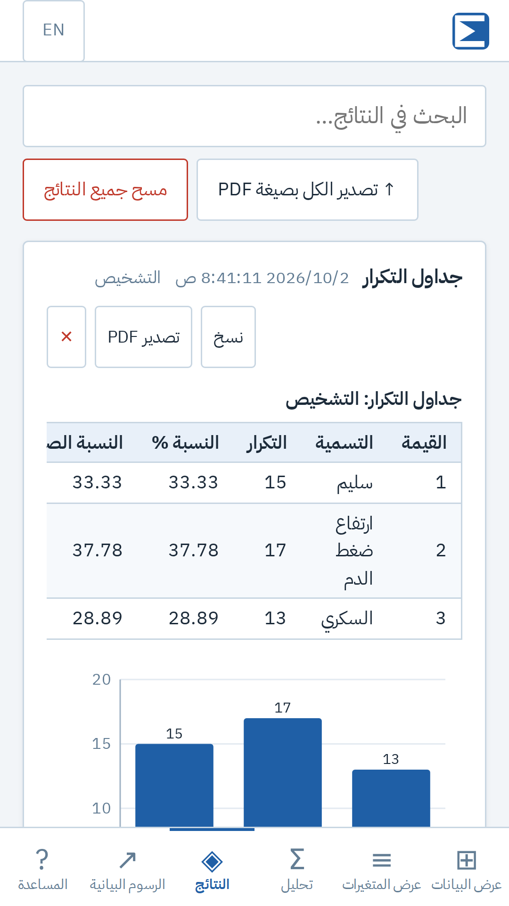
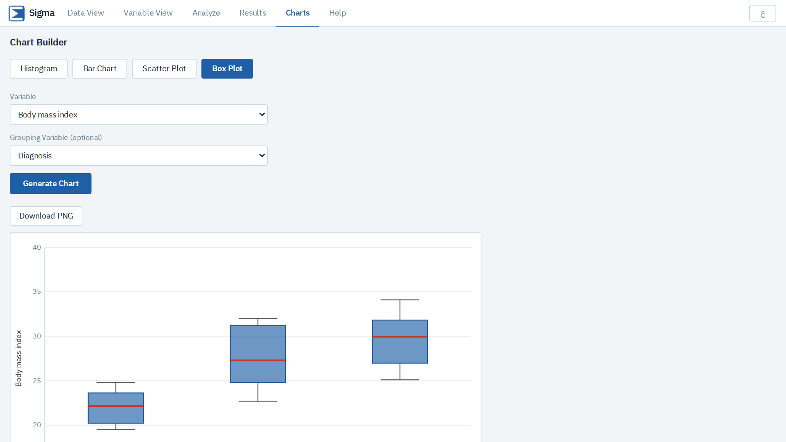

<div align="center">


# Sigma · سيغما

**SPSS-style statistics that run entirely on your phone or computer: Arabic-first, offline, private, and very light.**

**تحليل إحصائي بأسلوب SPSS يعمل بالكامل على جوالك أو حاسوبك: بالعربية، دون إنترنت، بخصوصية تامة، وخفيف جداً.**

[](https://github.com/almhdy24/sigma/actions/workflows/ci.yml)
[](LICENSE)
[](#install)

[**Open the app · افتح التطبيق**](https://sigma.almhdy24.com) ·
[User guide · دليل المستخدم](docs/user-guide.md) ·
[English guide](docs/user-guide.en.md) ·
[Contribute](CONTRIBUTING.md)

</div>

<p align="center">
  
  
  
</p>
<p align="center">
  
</p>

## بالعربية

سيغما أداة مجانية ومفتوحة المصدر لطلاب الطب والباحثين والمعلّمين:

- **إدخال البيانات** بأسلوب SPSS، واستيراد وتصدير CSV و Excel.
- **التحليلات:** الإحصاء الوصفي، جداول التكرار، الجداول التقاطعية (كاي تربيع)، الارتباط، اختبارات t، تحليل التباين مع توكي، الانحدار الخطي، ألفا كرونباخ، منحنى ROC، الاختبارات التشخيصية، والبدائل اللامعلمية مع فحص الافتراضات.
- **رسوم بيانية، وفقرة منهجية بأسلوب APA، وتصدير PDF بالعربية.**
- **بياناتك لا تغادر جهازك.** لا حسابات، ولا إعلانات، ولا تتبّع.
- **خفيف:** الواجهة حوالي 60 KB مضغوطة، وكل جزء يُنزَّل عند الحاجة فقط مع شريط تقدّم.
- **يعمل دون إنترنت** ويُثبَّت كتطبيق على أندرويد وآيفون والحاسوب، وقريباً على Google Play.

ابدأ بزر **«جرّب ببيانات مثال»** لتجربة كل شيء في ثوانٍ. التفاصيل في [دليل المستخدم](docs/user-guide.md).

## Features

| | |
|---|---|
| **Data** | Desktop spreadsheet grid and touch-friendly cards on phones; variable types, value labels, missing values, undo/redo; CSV and Excel import/export |
| **Transform** | Compute (safe formulas, missing values stay missing), Recode, Select Cases, Split File |
| **Analyses** | Descriptives, Frequencies, Crosstabs (χ², Cramér's V), Pearson and Spearman, t-tests (one-sample, independent, paired), one-way ANOVA with Tukey HSD, linear regression with VIF, Cronbach's α, ROC/AUC, diagnostic accuracy, Mann–Whitney, Wilcoxon, Kruskal–Wallis, Shapiro–Wilk, Levene |
| **Output** | Formatted tables, SVG charts (PNG export), APA methods paragraphs, PDF reports with correct Arabic shaping and bidi |
| **Languages** | Arabic (RTL) and English, switchable at any time |
| **Privacy** | Everything stays in IndexedDB on the device; no backend, no accounts, no analytics ([policy](public/privacy.html)) |

## Fast and light by design

| What | Size (gzipped) | When it downloads |
|---|---|---|
| App shell (UI, data entry, active language) | about 50 KB of JS + 9 KB CSS | first visit; then works offline |
| Each screen, dialog or exporter | 1–15 KB | first time it's opened |
| PDF export (jsPDF + Arabic fonts) | about 350 KB | first PDF export |
| Python core (Pyodide) | 13.8 MB | first analysis |
| NumPy / SciPy | 3.6 MB / 15 MB | first analysis that needs them |

- The engine downloads show a **progress bar with cancel**, and are kept for offline use.
- Python runs in a **Web Worker**, so the UI never freezes.
- Built with **Preact** plus a small hand-written grid, SVG charts and formula engine instead of React, AG Grid, Recharts and mathjs. That took the initial download from 3.75 MB to under 200 KB.

## Install

- **Web:** https://sigma.almhdy24.com
- **Android:** Chrome → ⋮ → *Install app*. Google Play: coming soon ([how it's packaged](docs/google-play.md)).
- **iPhone:** Safari → Share → *Add to Home Screen*.
- **Desktop:** the install icon in Chrome/Edge's address bar.

## Development

```bash
yarn install
yarn dev          # dev server
yarn lint         # ESLint
yarn test         # Vitest (stats tests need: pip install numpy==2.0.2 scipy==1.14.1)
yarn build        # production build → dist/
yarn preview      # serve the build
```

Read [docs/architecture.md](docs/architecture.md) before larger changes.

| Doc | |
|---|---|
| [User guide (AR)](docs/user-guide.md) · [(EN)](docs/user-guide.en.md) | How to use Sigma |
| [Architecture](docs/architecture.md) | Code layout, engine, caching, RTL |
| [Deployment](docs/deployment.md) | Vercel + `sigma.almhdy24.com` (Cloudflare DNS), GitHub Pages, other hosts |
| [Google Play](docs/google-play.md) | Packaging the PWA as a TWA with Bubblewrap; store listing |
| [Contributing](CONTRIBUTING.md) · [Code of Conduct](CODE_OF_CONDUCT.md) · [Security](SECURITY.md) | |

## Tech stack

Preact 10 · Vite 8 (Rolldown) · Workbox (vite-plugin-pwa) · Pyodide 0.27 (NumPy, SciPy) in a Web Worker · Zustand · i18next · jsPDF + bidi-js · read/write-excel-file · Papa Parse · Vitest

## License

[MIT](LICENSE) © Elmahdi. IBM Plex Sans Arabic © IBM Corp., [SIL Open Font License 1.1](src/assets/fonts/OFL-IBM-Plex.txt).
