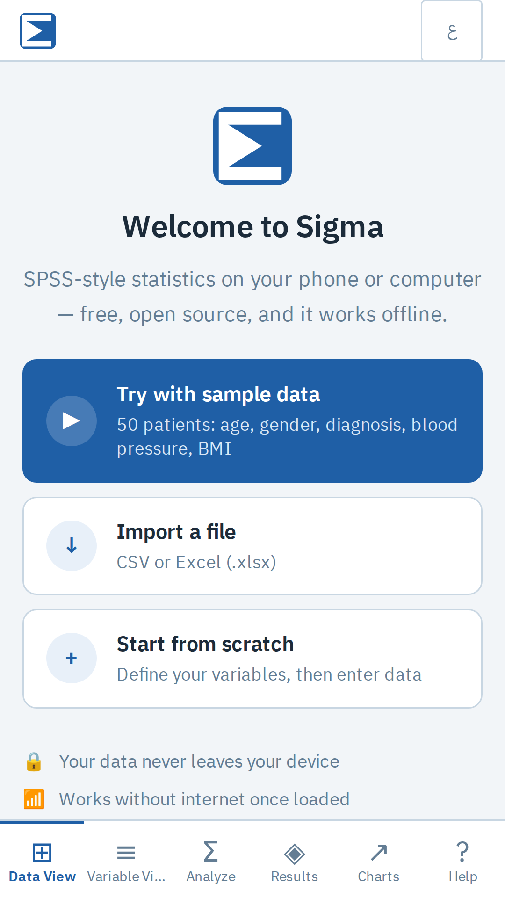

# Sigma User Guide

*[النسخة العربية](user-guide.md)*

Sigma is an SPSS-style statistics app that runs in your browser or as an installed app. Your data is stored only on your device.

## Getting started

On first launch Sigma offers three options:

| Option | What it does |
|---|---|
| **Try with sample data** | Loads 50 patients (age, gender, diagnosis, blood pressure, BMI) so you can try every analysis right away |
| **Import a file** | Opens a CSV or Excel file |
| **Start from scratch** | Takes you to Variable View to define your variables |

Use the **EN / ع** button to switch language.

## Install on your phone

- **Android (Chrome):** accept the "Install Sigma" banner, or open ⋮ → **Install app**. It is also available on Google Play once published.
- **iPhone (Safari):** Share ⬆️ → **Add to Home Screen**.
- **Desktop (Chrome / Edge):** use the install icon in the address bar.

## Variables and data

- **Variable View:** for each variable set its name (English letters, digits and `_`, used in formulas), label (any language), type, measurement level, value labels (`1 = Male`) and missing-value codes.
- **Data View:** on desktop, a spreadsheet grid. Click a cell and type, or press Enter / double-click to edit; move with the arrow keys and Tab. **Ctrl+Z** undoes and **Ctrl+Y** redoes. On phones each case is a card: tap to edit, **+** to add.

Everything is saved automatically on your device.

## Import and export

- **Import** CSV and Excel `.xlsx`. Column types are suggested; you can map columns to existing variables or skip them, and replace or append data. Legacy `.xls` files must be re-saved as `.xlsx` first.
- **Export** CSV (opens correctly in Excel, including Arabic) or Excel. From Variable View, **Export Codebook** produces a PDF.

## Transform

| Tool | Use |
|---|---|
| **Compute Variable** | New variable from a formula, e.g. `round(weight / (height/100)^2, 1)`. Supports `+ - * / ^`, comparisons, `and`/`or`, `cond ? a : b`, and `sqrt log ln exp round min max mean sum`. Missing inputs give a missing result |
| **Recode** | Map values or ranges to new values |
| **Select Cases** | Restrict analyses to a subset |
| **Split File** | Run each analysis separately per group |

## Analyses

| Analysis | Use it for |
|---|---|
| **Descriptive Statistics** | Mean, median, SD, skewness, kurtosis, outliers |
| **Frequencies** | Distribution of a categorical variable |
| **Crosstabs** | Two categorical variables (χ², Cramér's V) |
| **Correlations** | Pearson and Spearman |
| **T-Tests** | One-sample, independent and paired, with assumption checks and non-parametric alternatives |
| **One-Way ANOVA** | 3+ groups, with Tukey HSD and Kruskal–Wallis |
| **Linear Regression** | Predicting a scale outcome, with VIF |
| **Diagnostic Test** | Sensitivity, specificity, predictive values |
| **ROC Curve** | AUC of a continuous predictor |
| **Reliability (α)** | Cronbach's alpha |

Each analysis has a **?** button explaining when to use it, its assumptions and how to read the output.

### Downloads on demand
Computations use Python's scientific stack (NumPy, SciPy) running on your device. The first time an analysis runs, only the parts it needs are downloaded, with a progress bar and a cancel button: Python core (13.8 MB), NumPy (3.6 MB), SciPy (15 MB). They then work offline. To fetch everything at once, go to **Analyze → Download everything for offline use**.

## Charts, results and PDF

- Charts: histogram, bar, scatter and box plot (optionally grouped), each with **Download PNG**.
- Results are kept in the **Results** tab across sessions. You can copy them as text, export one result or a full report as PDF (Arabic is fully supported), and each includes an APA-style methods paragraph.

## Privacy

Nothing leaves your device. See the [privacy policy](../public/privacy.html).

Found a bug or have an idea? Open an issue on [GitHub](https://github.com/almhdy24/sigma/issues).
